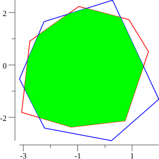

# polyclip 

`polyclip` computes the overlapping area of two overlapping polygon A and B
using the [Sutherland–Hodgman algorithm](https://en.wikipedia.org/wiki/Sutherland%E2%80%93Hodgman_algorithm).

